# **MISTIKA Bot - Текущая FSM Диаграмма**

## **📊 Реальное Состояние Telegram Bot**

*Основано на анализе кода handlers/index.js*

---

## **🔄 Основная FSM Диаграмма**

```mermaid
stateDiagram-v2
    [*] --> Start
    
    %% Начальная регистрация
    Start --> MainMenu: /start (user registration)
    
    %% Главное меню - центральный хаб
    MainMenu --> Reading: 🔮 Новое гадание
    MainMenu --> DailyCard: 🃏 Дневная карта
    MainMenu --> Lunar: 🌙 Лунный календарь
    MainMenu --> Numerology: 🔢 Нумерология
    MainMenu --> Profile: 👤 Профиль
    MainMenu --> Premium: 💎 Премиум
    MainMenu --> WebApp: 📱 Приложение
    MainMenu --> Settings: ⚙️ Настройки
    MainMenu --> Help: ❓ Помощь
    
    %% Состояние ожидания вопроса
    MainMenu --> WaitingQuestion: Free text input
    WaitingQuestion --> QuestionPending: Valid question (5-500 chars)
    WaitingQuestion --> MainMenu: Invalid input
    QuestionPending --> Reading: Select spread type
    
    %% Поток создания гадания
    Reading --> SpreadSelection: Show spread menu
    SpreadSelection --> CardRitual: reading_single/three/celtic/relationship
    SpreadSelection --> QuestionFirst: ask_question_first
    QuestionFirst --> WaitingQuestion: Prompt for question
    
    %% Ритуал карт с состояниями
    CardRitual --> Preparation: conductTarotRitual() [pendingReadings.set()]
    Preparation --> Shuffling: 2s delay
    Shuffling --> AIProcessing: 1.5s delay
    AIProcessing --> CardsReady: AI interpretation + mystical layout
    
    %% Интерактивное раскрытие карт
    CardsReady --> CardRevealing: reveal_card_{index}
    CardRevealing --> CardsReady: More cards to reveal
    CardRevealing --> AllRevealed: All cards revealed
    AllRevealed --> ShowInterpretation: show_interpretation
    ShowInterpretation --> ReadingComplete: Full interpretation shown
    ReadingComplete --> MainMenu: back_to_menu [pendingReadings.delete()]
    
    %% Дневная карта (простой поток)
    DailyCard --> DailyProcessing: Generate random card
    DailyProcessing --> DailyResult: AI interpretation
    DailyResult --> DailyDetails: daily_details (optional)
    DailyResult --> MainMenu: back_to_menu
    DailyDetails --> MainMenu: back_to_menu
    
    %% Нумерология (новая система)
    Numerology --> NumMenuCheck: Check existing profile
    NumMenuCheck --> NumMenu: Has profile
    NumMenuCheck --> NumWaitBirth: No profile
    NumWaitBirth --> NumWaitName: Valid birthdate [userSessions.set(step: 'waiting_fullname')]
    NumWaitBirth --> NumWaitBirth: Invalid format
    NumWaitName --> NumProcessing: Valid name [calculate numerology]
    NumWaitName --> NumWaitName: Invalid name
    NumProcessing --> NumResult: Show profile + options
    NumResult --> NumMenu: Back to numerology menu
    NumMenu --> MainMenu: back_to_menu [userSessions.delete()]
    
    %% Лунный календарь
    Lunar --> LunarMenu: Show current phase
    LunarMenu --> LunarCalendar: lunar_calendar
    LunarMenu --> LunarReading: lunar_reading
    LunarCalendar --> LunarMenu: Calendar shown
    LunarReading --> LunarMenu: Reading complete
    LunarMenu --> MainMenu: back_to_menu
    
    %% Премиум подписка
    Premium --> PremiumMenu: Show subscription status
    PremiumMenu --> ExtendPremium: extend_premium
    PremiumMenu --> PremiumStats: premium_stats
    ExtendPremium --> PaymentPlans: Show pricing
    PaymentPlans --> PaymentStub: premium_plan_* [placeholder]
    PaymentStub --> ExtendPremium: Back to plans
    PaymentStub --> MainMenu: back_to_menu
    PremiumStats --> PremiumMenu: Back to premium
    PremiumMenu --> MainMenu: back_to_menu
    
    %% Профиль
    Profile --> ProfileMenu: Show user stats
    ProfileMenu --> ProfileStats: profile_stats [placeholder]
    ProfileMenu --> ProfileHistory: reading_history [placeholder]
    ProfileMenu --> Numerology: numerology
    ProfileStats --> ProfileMenu: Back
    ProfileHistory --> ProfileMenu: Back
    ProfileMenu --> MainMenu: back_to_menu
    
    %% Настройки (заглушки)
    Settings --> SettingsMenu: Show settings [PLACEHOLDER]
    SettingsMenu --> MainMenu: back_to_menu
    
    %% Помощь
    Help --> HelpInfo: Show help text
    HelpInfo --> MainMenu: back_to_menu
    
    %% WebApp
    WebApp --> WebAppRedirect: Redirect to web version
    WebAppRedirect --> MainMenu: Return to bot
```



---

## **🗂️ Карта Состояний (State Maps)**

### **💾 Активные State Maps**

```javascript
// Основные состояния
this.pendingQuestions = new Map();     // chatId -> { questionId, question, timestamp }
this.pendingReadings = new Map();      // chatId -> { cards, revealed, userQuestion, timestamp }
this.userProfiles = new Map();         // chatId -> { profile, birthDate, fullName, lastAnalysis }

// Нумерология (новая система)
this.numerologyHandler.userSessions = new Map(); // chatId -> { step, birthDate, fullName, ... }

// Устаревшая нумерология (в процессе удаления)
this.pendingNumerology = new Map();    // DEPRECATED - постепенно удаляется
```

### **⏰ Lifecycle Management**

```javascript
// Автоматическая очистка каждые 10 минут
setInterval(() => {
  this.cleanupOldQuestions();      // Удаляет questions старше 30 минут
  this.cleanupPendingStates();     // Удаляет readings старше 30 минут
}, 10 * 60 * 1000);

// Ручная очистка при переключении контекста
// Все меню кнопки очищают this.pendingNumerology?.delete(chatId)
// КРОМЕ кнопки "🔢 Нумерология"
```

---

## **🔀 Transition Rules**

### **🎯 Entry Points**

| Trigger | From State | To State | State Changes |
|---------|------------|----------|---------------|
| `/start` | `[*]` | `MainMenu` | User registration |
| Menu buttons | `MainMenu` | Specific flows | Clean `pendingNumerology` (except numerology) |
| Free text | `MainMenu` | `WaitingQuestion` | Validate & store question |
| Callback queries | Any state | Target state | Route by prefix (`reading_`, `premium_`, etc.) |

### **🧹 State Cleanup Rules**

```javascript
// При переключении на NON-numerology функции
this.pendingNumerology?.delete(chatId);

// При завершении гадания
this.pendingReadings.delete(chatId);

// При ошибке или back_to_menu
this.pendingQuestions?.delete(chatId);
this.pendingReadings?.delete(chatId);
// НО userProfiles НИКОГДА не очищается
```

### **🔧 Current Issues**

#### **🔴 Критические Проблемы**

1. **Dual Numerology Systems**
   ```
   OLD: this.pendingNumerology (deprecated but still cleaned)
   NEW: this.numerologyHandler.userSessions (active)
   ```

2. **Memory Leak**
   ```
   this.userProfiles - растет бесконечно, никогда не очищается
   ```

3. **State Conflicts**
   ```
   Пользователь может быть одновременно в:
   - pendingQuestions
   - pendingReadings  
   - numerologyHandler.userSessions
   ```

#### **🟡 Проблемы Потока**

4. **Stuck States**
   - **Numerology Limbo**: Переключение между старой/новой системой
   - **Reading Timeout**: Если AI interpretation падает
   - **Callback Timeout**: "query is too old" блокирует transitions

5. **Missing Cancellation**
   - Нет способа отменить активный поток
   - `back_to_menu` не всегда доступен во всех состояниях

---

## **📈 Actual vs Intended Behavior**

### **✅ Что Работает**

- **Main Menu Navigation**: Все кнопки корректно переключают состояния
- **Reading Flow**: Полный цикл от вопроса до интерпретации
- **Daily Card**: Простой, безошибочный поток
- **Numerology (New)**: Пошаговый ввод данных и обработка
- **Premium Menu**: Навигация по опциям (хотя заглушки)

### **❌ Что Сломано**

- **Settings Callbacks**: `settings_*` callbacks не реализованы
- **History/Stats**: Все placeholders, нет реальной функциональности
- **Payment Integration**: Только заглушки
- **State Persistence**: При перезапуске бота все состояния теряются
- **Error Recovery**: Ограниченные возможности восстановления

### **🔄 Inconsistent Patterns**

```javascript
// Разные подходы к state management:
this.pendingQuestions.set(chatId, { ... });           // Explicit state
await this.numerologyHandler.handleText(bot, msg);    // Delegated state
await this.handleReadingCommand(bot, msg);             // Stateless call
```

---

## **🎯 Заключение**

**Текущая FSM функциональна, но хрупкая:**

- ✅ **Основные потоки работают** (reading, daily, numerology)
- ⚠️ **Есть критические проблемы** (memory leaks, dual systems)
- ❌ **Много заглушек** требуют доработки
- 🔧 **Архитектура нуждается в рефакторинге**

**Приоритетные исправления:**
1. Удалить старую numerology систему
2. Добавить cleanup для userProfiles  
3. Реализовать settings callbacks
4. Добавить state persistence
5. Создать единый StateManager класс

---

*Диаграмма создана на основе реального анализа кода 2025-01-06*