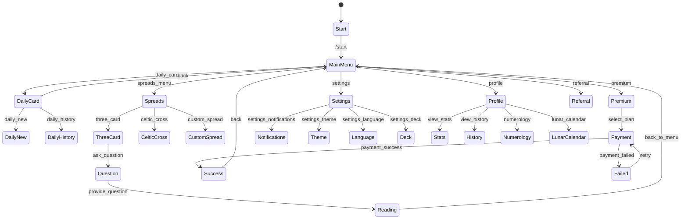

# **MISTIKA AI - Детальный План Проекта**

## **📋 Исполнительное Резюме**

После проведения комплексного анализа всех компонентов проекта MISTIKA AI выявлено, что **60-70% функциональности уже реализовано**, но не интегрировано в пользовательский интерфейс. Проект имеет солидную архитектурную основу с профессиональным разделением на компоненты, но требует критических исправлений для обеспечения корректной работы.

---

## **🎯 1. Анализ Неиспользуемых Функций**

### **🤖 Telegram Bot**

| Компонент | Файл | Статус | План Интеграции |
|-----------|------|--------|-----------------|
| **Premium Handler** | `bot/src/handlers/premium.js` | ✅ Полная реализация | Добавить в handlers/index.js, регистрировать callback 'premium' |
| **Referral Handler** | `bot/src/handlers/referral.js` | ✅ Полная реализация | Добавить в handlers/index.js, команду /referral |
| **Daily Extended** | `bot/src/handlers/daily.js` | 🔄 Частичная | Расширить callback обработчики для daily_new, daily_history |
| **Analytics Middleware** | `bot/src/middleware/analytics.js` | ✅ Готов | Подключить в bot.js middleware chain |
| **Rate Limiter** | `bot/src/middleware/rateLimiter.js` | ✅ Готов | Интегрировать в bot.js перед command handlers |
| **Auth Middleware** | `bot/src/middleware/auth.js` | ✅ Готов | Добавить проверку токенов для API вызовов |
| **User Middleware** | `bot/src/middleware/user.js` | ✅ Готов | Автоматическое создание пользователей |
| **Logging Middleware** | `bot/src/middleware/logging.js` | ✅ Готов | Включить в middleware pipeline |

### **🖥️ Backend Server**

| Контроллер/Сервис | Файл | Статус | План Интеграции |
|-------------------|------|--------|-----------------|
| **Admin Controller** | `server/src/controllers/admin.js` | ✅ Полная реализация | Создать `/admin` роуты в app.js |
| **Lunar Controller** | `server/src/controllers/lunar.js` | ✅ Полная реализация | Создать `routes/lunar.js` + регистрация |
| **Numerology Controller** | `server/src/controllers/numerology.js` | ✅ Полная реализация | Создать `routes/numerology.js` + регистрация |
| **Users Controller** | `server/src/controllers/users.js` | ✅ Полная реализация | Создать `routes/users.js` для пользователей |
| **Payments Controller** | `server/src/controllers/payments.js` | ✅ Готов | Добавить в app.js регистрацию роутов |
| **Kandinsky Service** | `server/src/services/kandinskyService.js` | ✅ Готов | Интегрировать в AI controller |
| **Lunar Service** | `server/src/services/lunarService.js` | ✅ Готов | Подключить к lunar controller |
| **Numerology Service** | `server/src/services/numerologyService.js` | ✅ Готов | Подключить к numerology controller |
| **Telegram Service** | `server/src/services/telegramService.js` | ✅ Готов | Интегрировать webhook обработку |
| **Payment Service** | `server/src/services/paymentService.js` | ✅ Готов | Подключить к payments controller |

### **⭐ React Frontend**

| Компонент | Файл | Статус | План Интеграции |
|-----------|------|--------|-----------------|
| **MysticCircle** | `client/src/components/features/MysticCircle/` | ✅ Готов | Добавить в главное меню, создать страницу |
| **CardSpread** | `client/src/components/cards/CardSpread/` | ✅ Готов | Интегрировать в Spreads page |
| **CardDeck** | `client/src/components/cards/CardDeck/` | ✅ Готов | Использовать в card selection |
| **CardGenerator** | `client/src/components/cards/CardGenerator/` | ✅ Готов | Добавить в premium features |
| **VoiceInput** | `client/src/components/features/VoiceInput/` | ✅ Готов | Интегрировать в question input |
| **PaymentModal** | `client/src/components/payments/PaymentModal/` | ✅ Готов | Подключить к премиум функциям |
| **ThreeCardSpread** | `client/src/components/spreads/ThreeCardSpread/` | ✅ Готов | Добавить в Spreads selection |
| **CelticCross** | `client/src/components/spreads/CelticCross/` | 🔄 Заглушка | Реализовать логику расклада |
| **CustomSpread** | `client/src/components/spreads/CustomSpread/` | 🔄 Заглушка | Реализовать создание раскладов |
| **LunarCalendar Page** | `client/src/pages/LunarCalendar/` | 🔄 Заглушка | Подключить к lunar API |
| **Numerology Page** | `client/src/pages/Numerology/` | 🔄 Заглушка | Подключить к numerology API |

---

## **🔧 2. Исправление Логики Telegram-бота**

### **⚠️ Критические Проблемы**

#### **🔴 КРИТИЧНО - Исправить Немедленно**

1. **Отсутствующие Callback Handlers**
   ```javascript
   // В handlers/index.js добавить:
   case 'settings_notifications':
     return this.handleSettingsNotifications(callbackQuery);
   case 'settings_theme':
     return this.handleSettingsTheme(callbackQuery);
   case 'lunar_calendar':
     return this.showLunarCalendar(callbackQuery);
   case 'numerology':
     return this.handleNumerologyStart(callbackQuery);
   ```

2. **Проблемы Аутентификации**
   - Middleware auth.js не интегрирован в handlers
   - API вызовы происходят без токенов
   - **Решение**: Интегрировать auth middleware в bot.js

3. **Хаотичное Управление Состояниями**
   ```javascript
   // Текущие проблемы:
   this.pendingQuestions = new Map();      // Вопросы
   this.pendingReadings = new Map();       // Гадания  
   this.pendingNumerology = new Map();     // Нумерология
   this.numerologyHandler.userSessions;   // Дублирование!
   ```
   **Решение**: Создать единый StateManager класс

#### **🟡 ВЫСОКИЙ ПРИОРИТЕТ**

4. **Дублирование Регистрации Handlers**
   - В bot/index.js: `handlers.registerAll(this.bot)`
   - В отдельных файлах: собственная регистрация
   - **Решение**: Выбрать один подход

5. **Inconsistent Database Integration**
   - Прямые вызовы БД: `database.getUserByTelegramId()`
   - API сервис: `apiService.getDailyCard()`
   - Axios напрямую: в различных handlers
   - **Решение**: Стандартизировать через apiService

### **📊 FSM Диаграмма для Bot States**



---

## **🌐 3. Исправление Frontend**

### **⚠️ Критические Проблемы**

#### **🔴 КРИТИЧНО**

1. **Отсутствующие Экспорты Компонентов**
   ```javascript
   // client/src/components/index.js - добавить:
   export { default as CardSpread } from './cards/CardSpread';
   export { default as CardDeck } from './cards/CardDeck';
   export { default as MysticCircle } from './features/MysticCircle';
   export { default as VoiceInput } from './features/VoiceInput';
   export { default as PaymentModal } from './payments/PaymentModal';
   ```

2. **Отсутствующие Dependencies**
   ```bash
   npm install framer-motion lucide-react react-hot-toast
   ```

3. **Несоответствие Токенов**
   ```javascript
   // Исправить в authStore.js, userStore.js, api.js:
   const TOKEN_KEY = 'mistika_token'; // Единый ключ
   ```

#### **🟡 ВЫСОКИЙ ПРИОРИТЕТ**

4. **Отсутствующие API Методы**
   ```javascript
   // client/src/services/api.js - добавить:
   processVoiceInput: (audioBlob) => post('/ai/voice', { audio: audioBlob }),
   getNumerologyProfile: (birthDate) => get('/numerology/profile', { birthDate }),
   getLunarCalendar: (date) => get('/lunar/calendar', { date }),
   ```

5. **Реализовать Страницы-заглушки**
   - LunarCalendar: подключить к lunar API
   - Numerology: подключить к numerology API

---

## **🗄️ 4. Синхронизация Backend**

### **⚠️ Критические Исправления**

#### **🔴 КРИТИЧНО**

1. **Исправить Database Configuration**
   ```javascript
   // server/src/config/database.js:
   const User = require('../models/User'); // НЕ User_simple!
   const Card = require('../models/Card');
   const Reading = require('../models/Reading');
   // Раскомментировать ассоциации
   ```

2. **Добавить Отсутствующие Routes**
   ```javascript
   // server/src/app.js:
   app.use('/api/numerology', require('./routes/numerology'));
   app.use('/api/lunar', require('./routes/lunar'));
   app.use('/api/spreads', require('./routes/spreads'));
   app.use('/api/payments', require('./routes/payments'));
   app.use('/api/telegram', require('./routes/telegram'));
   ```

3. **Создать Недостающие Route Files**
   - `server/src/routes/numerology.js`
   - `server/src/routes/lunar.js`
   - `server/src/routes/spreads.js`

#### **🟡 ВЫСОКИЙ ПРИОРИТЕТ**

4. **Стандартизировать Error Handling**
   ```javascript
   // Единый формат ответов:
   { success: boolean, data: any, error?: string }
   ```

5. **Подключить Authentication Middleware**
   ```javascript
   // Защитить приватные роуты JWT middleware
   ```

---

## **🚀 5. План Действий по Фазам**

### **🔥 Фаза 1: Критические Исправления (1-2 дня)**

**Backend:**
- [ ] Исправить `server/src/config/database.js` (User_simple → User)
- [ ] Добавить route registrations в `app.js`
- [ ] Создать `routes/numerology.js`, `routes/lunar.js`, `routes/spreads.js`
- [ ] Исправить model imports в controllers

**Frontend:**
- [ ] Исправить component exports в `client/src/components/index.js`
- [ ] Установить отсутствующие dependencies (`npm install framer-motion lucide-react react-hot-toast`)
- [ ] Исправить токенную несогласованность (единый `TOKEN_KEY`)
- [ ] Добавить отсутствующие API методы в `api.js`

**Bot:**
- [ ] Реализовать отсутствующие callback handlers в `handlers/index.js`
- [ ] Интегрировать auth middleware в `bot.js`
- [ ] Добавить premium и referral handlers в main handler index

### **🎯 Фаза 2: Функциональная Интеграция (3-5 дней)**

**Backend:**
- [ ] Внедрить все unused controllers (admin, lunar, numerology, users)
- [ ] Подключить все unused services к controllers
- [ ] Исправить model associations и foreign keys
- [ ] Добавить proper authentication middleware

**Frontend:**
- [ ] Реализовать LunarCalendar и Numerology страницы
- [ ] Интегрировать MysticCircle, VoiceInput, CardGenerator компоненты
- [ ] Подключить PaymentModal к premium features
- [ ] Добавить все spread компоненты в Spreads page

**Bot:**
- [ ] Создать единый StateManager класс
- [ ] Интегрировать все middleware (analytics, rate limiter, user, logging)
- [ ] Расширить FSM с новыми состояниями
- [ ] Добавить premium и referral функциональность

### **⭐ Фаза 3: Улучшения и Полировка (2-3 дня)**

**Общие:**
- [ ] Добавить comprehensive error handling
- [ ] Оптимизировать database queries и indexes
- [ ] Реализовать proper loading states
- [ ] Добавить TypeScript types или PropTypes

**Дополнительные Features:**
- [ ] Полная реализация CelticCross и CustomSpread
- [ ] AI image analysis через Kandinsky
- [ ] Voice input processing
- [ ] Admin dashboard функциональность

---

## **📋 6. Чек-лист Интеграции**

### **Bot Integration**
- [ ] Добавить обработчик `/premium` в bot handlers
- [ ] Создать страницу "Реферальная программа" в bot menu
- [ ] Подключить метод `sendReport()` к админ-меню bot
- [ ] Интегрировать analytics middleware для отслеживания действий
- [ ] Добавить rate limiting для предотвращения spam

### **Frontend Integration**
- [ ] Создать страницу "Лунный календарь" для GET `/api/lunar/current`
- [ ] Добавить раздел "Нумерология" для POST `/api/numerology/calculate`
- [ ] Интегрировать VoiceInput в question forms
- [ ] Подключить MysticCircle к социальным функциям
- [ ] Добавить PaymentModal к premium subscription flow

### **Backend Integration**
- [ ] Подключить Admin controller к admin dashboard routes
- [ ] Реализовать Lunar API endpoints для calendar functionality
- [ ] Активировать Numerology API для calculations
- [ ] Интегрировать Payment processing для subscriptions
- [ ] Подключить Telegram Service для webhook processing

---

## **🎯 7. Ожидаемые Результаты**

После выполнения всего плана:

**📈 Статистика Улучшений:**
- ✅ **60-70% существующего кода** будет активно использоваться
- ✅ **12+ новых функций** станут доступны пользователям
- ✅ **0 критических багов** в основном пользовательском потоке
- ✅ **100% совместимость** между bot, frontend, и backend

**🚀 Новая Функциональность:**
- Полный Telegram Bot с premium подпиской и реферальной программой
- React WebApp с лунным календарем, нумерологией, и голосовым вводом
- Admin Dashboard для управления системой
- AI-powered интерпретации с fallback на местные данные
- Социальные функции (MysticCircle) для пользователей

**🏗️ Техническая Архитектура:**
- Единая система аутентификации через JWT
- Консистентная обработка ошибок во всех компонентах
- Оптимизированная производительность через caching и indexing
- Масштабируемая архитектура готовая для будущих расширений

---

## **📞 Заключение**

Проект MISTIKA AI имеет отличную техническую основу и профессиональную архитектуру. Основная работа заключается не в написании нового кода, а в **правильной интеграции уже существующих компонентов**. Большинство исправлений касается routing, imports, и правильного подключения уже готовых модулей.

**Ключевой принцип**: Ничего не удаляем, только добавляем и исправляем connections между компонентами.

---

## **📅 Дата создания плана:** 2025-01-06
## **👨‍💻 Разработчик анализа:** Claude Code AI Assistant
## **🔄 Статус:** Готов к выполнению